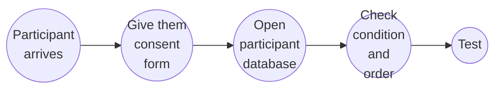

# Will Decker's Honors Thesis Protocol

#### In this document is a detailed discription which instructs an individual on how to execute Will Decker's Honors Thesis experimental paradigm.

## Table of Contents

#### 1. [Project Synopsis](#1-project-synopsis-1)

#### 2. [Methods and Materials](#2-methods-and-materials-1)

#### 3. [Your role](#3-your-role-1)

#### 4. [The fMRI scan](#4-the-fmri-scan-1)

#### 5. [The post-test](#5-the-post-test-1)

#### 6. [Data sharing](#6-data-sharing-1)

#### 7. [Flowchart](#7-flowchart-1)

#### 8. [Contact](#8-contact-1)

# 1. Project Synopsis

#### In this project, we are looking at the dynamic nature of statistical learning (SL), a cognitive mechanism involved in low dimensional perceptual learning. Our environment is complex yet structured.

#### In the case of auditory and linguistic input, the structure of such input is defined by its internal transitional probabilities within and across perceptual units. So, in the case of language, the transitional probabilities within and across words allows the humann (infant) brain to segment input and extract word boundaries.

#### In the literature SL is often unintentionally described as a unitary process. Here, we challenge this notion by proposing a mechanistic neurocognitive model of SL, which we've termed the three-process model of SL (3PSL). We posit that 1.) perception must first take place before 2.) encoding can occur. Once an individual has learned/encoded the strucutre, 3.) prediction can occur given the learned information.

#### We expect to see this theoretical model implicated in the neural activity taking place during SL.

#### Here, we are exposing individuals to either structured or unstructured phonological sequences while lying in the scanner. Then, participants will be tested on whether they learned the structured.

# 2. Methods and Materials

## 2.1 Magnetic Resonance Imaging (MRI) Scanner

#### This particular project makes use of MRI, more specifically, functional MRI (fMRI). FMRI relies on the changes in blood flow as a proxy for neural activity; as neurons fire, blood is carried to neurons to replenish their energy. Importantly, this haemodynamic response has detectable magnetic properties. This is the basis of fMRI. The fMRI scan records changes in blood flow occurs as a consequence of neural activity.

#### The MRI scanner is located at [Pennington Biomedical Research Center (PBRC)](https://www.pbrc.edu/). Unless you are **Level 2** certified, you will be operating the scanner in a supportive capacity, while the MRI technician, Kevin, takes care of the bulk of the acquisition protocol.

## 2.2 Computer

#### There are two paradigms which are executed in this experiment: 1.) the exposure and 2.) the test. These are done of two _separate_ computers.

#### The exposure is executed from the Dell computer located in the control room during the fMRI scan. More on this in [Section 3](#4-the-fmri-scan-1).

#### The test is executed on a Mac laptop that _you_ must bring. More on this in [Section 5](#5-the-post-test-1).

## 2.3 Headphones

#### During the post-test, it is recommended that participants wear headphones. If you do not have the proper headphones, please contact Will.

## 2.4 Keyboard stickers

#### During the post-test participants must select one of three choices, denoted by three different colored squars on the screen. One of these three choices is selected by pressing the corresponding colored key on the keyboard. This requires that stickers be placed on the correct keys. More on this in [Section 5](#5-the-post-test-1). Stickers will be provided by Will. If you need more, please contact Will.

## 2.5 Participant database

#### Information as to the conditions of a specific participant are located on a shard Box file. This is a dynamic file. If you are running a participant, it will follow the previous participant. Below is a model of what this looks like

| **Subject ID** | **DOT**    | **COND** | **ORDER** | **NOTES**        |
| -------------- | ---------- | -------- | --------- | ---------------- |
| sub-001        | 11/30/2023 | S        | 2         | N/A              |
| sub-002        | 12/01/2023 | R        | 2         | No resting state |
| sub-003        | 12/02/2023 | S        | 1         | N/A              |
| sub-004        | 12/03/2023 | S        | 1         | N/A              |
| ...            | ...        | ...      | ...       | ...              |
| sub-nnn        | MM/DD/YYYY | ...      | ...       | N/A              |

#### Importantly, the condition and order are determined via a column in the database called **Choose**.

| **Choose**  |
| ----------- |
| `condition` |
| `order`     |

#### Except, in the place of `condition` and `order`, are either the values **S** or **R** and **1** or **2** respectively. This column is updated every time the database is opened and it randomly chooses the conditions a participant receives. You will be responsible for copying these values over into the main database table.

#### So, when you are running a participant, you will look at the previous subject ID. Yours is the next one. For example, if the subject ID, sub-004 is already filled in (this means that a participant has been run and there is accompanying data), then you will be running sub-005.

# 3. Your role

#### Your role in this experiment is to oversee the execution of the experimental paradigms.

#### You will be in charge of loading the exposure and running it while the participant is in the scanner.

#### You will be in charge of loading the post-test and running it while the participant is sitting in the control room after the scan.

#### You will be in charge of sharing the data with collaborators and Will.

# 4. The fMRI scan

#### Ideally, this entire experiment (i.e., Will's Honors Thesis) should occur at the _end_ of the current study being conducted. The fMRI scan is acquired using a typicaly resting state protocol. The exposure is executed during the fMRI scan. The acquisition parameters for the scan specifically pertaining to the exposure already exist on the system software at PBRC. The name of the acquisition is GET NAME.

#### To execute the exposure, open the Dell computer in the control room. The paradigm was created with PsychoPy and is located at the following path: GET PATH.

#### You will then be prompted with two pop up

# 5. The post-test

#### The post-test must be executed on a Mac laptop. The code to execute this is located in the shared Box folder.

#### In this post-test, participants completed a three-alternative forced choice task, in which some sound from the scanner (target sound) and two other sounds (foil sounds) are pitted against eachother. There are 12 trials. Each sound (the two foils and one target) are played one after another and the order in which they are presented is counter balanced.

# 6. Data sharing

#### PLEASE ASK THE MRI TECHNICIAN, KEVIN, TO ADD WILL'S EMAIL TO THE DATA SHARING LINK! If possible, please only share the requried data (i.e., the data acquired from GET PROTOCOL NAME).

#### The post-test data must also be shared. It get's outputted to a folder within the same directory in which the post-test was run from. Please upload it to the shared Box folder.

# 7. Flowchart

#### Below is a flow chart explaining the entireity of this experimental workflow.

# 8. Contact

#### All initial inquiries should be made to Will. Please contact the other individuals on an as needed basis.

| Name               | Role         | Email                                       |
| ------------------ | ------------ | ------------------------------------------- |
| Will Decker        | Project lead | [jdecke5@lsu.edu](mailto:jdecke5@lsu.edu)   |
| Chris Cox          | PI           | [chriscox@lsu.edu](mailto:chriscox@lsu.edu) |
| Julie M. Schneider | Collaborator | [juschnei@lsu.edu](mailto:juschnei@lsu.edu) |
